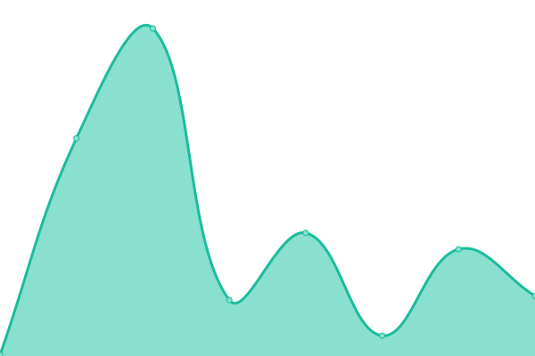

# [📈 Live Status](https://startwebservicesbackup.com): <!--live status--> **🟧 Partial outage**

This repository contains the open-source uptime monitor and status page for [Haj McGreuder](charwebs.com), powered by [Upptime](https://github.com/upptime/upptime).

With [Upptime](https://upptime.js.org), you can get your own unlimited and free uptime monitor and status page, powered entirely by a GitHub repository. We use [Issues](https://github.com/haj420/upptime/issues) as incident reports, [Actions](https://github.com/haj420/upptime/actions) as uptime monitors, and [Pages](https://startwebservicesbackup.com) for the status page.

<!--start: status pages-->
<!-- This summary is generated by Upptime (https://github.com/upptime/upptime) -->
<!-- Do not edit this manually, your changes will be overwritten -->
<!-- prettier-ignore -->
| URL | Status | History | Response Time | Uptime |
| --- | ------ | ------- | ------------- | ------ |
|  [Google](https://www.google.com) | 🟩 Up | [google.yml](https://github.com/haj420/uptime/commits/HEAD/history/google.yml) | 

 94ms
     
 | 

<a href="https://startwebservicesbackup.com/history/google">100.00%</a>
    

|  [Wikipedia](https://en.wikipedia.org) | 🟩 Up | [wikipedia.yml](https://github.com/haj420/uptime/commits/HEAD/history/wikipedia.yml) | 

 101ms
     
 | 

<a href="https://startwebservicesbackup.com/history/wikipedia">100.00%</a>
    

|  [Hacker News](https://news.ycombinator.com) | 🟩 Up | [hacker-news.yml](https://github.com/haj420/uptime/commits/HEAD/history/hacker-news.yml) | 

 212ms
     
 | 

<a href="https://startwebservicesbackup.com/history/hacker-news">100.00%</a>
    

|  [AFS](https://autoformsandsupplies.com) | 🟩 Up | [afs.yml](https://github.com/haj420/uptime/commits/HEAD/history/afs.yml) | 

 1932ms
     
 | 

<a href="https://startwebservicesbackup.com/history/afs">100.00%</a>
    

|  [ASP](https://autoserviceproducts.com) | 🟩 Up | [asp.yml](https://github.com/haj420/uptime/commits/HEAD/history/asp.yml) | 

 7753ms
     
 | 

<a href="https://startwebservicesbackup.com/history/asp">100.00%</a>
    

|  [Annies Spa](https://anniesspa.com) | 🟩 Up | [annies-spa.yml](https://github.com/haj420/uptime/commits/HEAD/history/annies-spa.yml) | 

 740ms
     
 | 

<a href="https://startwebservicesbackup.com/history/annies-spa">100.00%</a>
    

|  [AUB](https://andersonunderbridge.com) | 🟩 Up | [aub.yml](https://github.com/haj420/uptime/commits/HEAD/history/aub.yml) | 

 1658ms
     
 | 

<a href="https://startwebservicesbackup.com/history/aub">100.00%</a>
    

|  [beverlyelamin](www.beverlyelamin.com) | 🟥 Down | [beverlyelamin.yml](https://github.com/haj420/uptime/commits/HEAD/history/beverlyelamin.yml) | 

 0ms
     
 | 

<a href="https://startwebservicesbackup.com/history/beverlyelamin">6.54%</a>
    

|  [CHESNET](www.chesnet.net) | 🟩 Up | [chesnet.yml](https://github.com/haj420/uptime/commits/HEAD/history/chesnet.yml) | 

 1774ms
     
 | 

<a href="https://startwebservicesbackup.com/history/chesnet">100.00%</a>
    

|  [Conterra](https://conterra.com) | 🟩 Up | [conterra.yml](https://github.com/haj420/uptime/commits/HEAD/history/conterra.yml) | 

 1376ms
     
 | 

<a href="https://startwebservicesbackup.com/history/conterra">100.00%</a>
    

|  [Covenant](www.covenantpresby.net) | 🟩 Up | [covenant.yml](https://github.com/haj420/uptime/commits/HEAD/history/covenant.yml) | 

 387ms
     
 | 

<a href="https://startwebservicesbackup.com/history/covenant">100.00%</a>
    

|  [greenefuneralhome](www.greenefuneralhome.net) | 🟩 Up | [greenefuneralhome.yml](https://github.com/haj420/uptime/commits/HEAD/history/greenefuneralhome.yml) | 

 767ms
     
 | 

<a href="https://startwebservicesbackup.com/history/greenefuneralhome">100.00%</a>
    

|  [JMCope](www.jmcope.com) | 🟩 Up | [jm-cope.yml](https://github.com/haj420/uptime/commits/HEAD/history/jm-cope.yml) | 

 239ms
     
 | 

<a href="https://startwebservicesbackup.com/history/jm-cope">100.00%</a>
    

|  [Test Broken Site](https://thissitedoesnotexist.koj.co) | 🟥 Down | [test-broken-site.yml](https://github.com/haj420/uptime/commits/HEAD/history/test-broken-site.yml) | 

 0ms
     
 | 

<a href="https://startwebservicesbackup.com/history/test-broken-site">100.00%</a>
    

<!--end: status pages-->

[**Visit our status website →**](https://startwebservicesbackup.com)

## 📄 License

- Powered by: [Upptime](https://github.com/upptime/upptime)
- Code: [MIT](./LICENSE) © [Haj McGreuder](charwebs.com)
- Data in the `./history` directory: [Open Database License](https://opendatacommons.org/licenses/odbl/1-0/)
